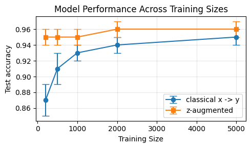

# A simple experiment

A simple experiment demonstrates how access to high-quality oracle can enable faster learning. The data is generated according to the following data-generating process:

$$
\begin{align*}
    & \text{Clean labels as oracle} \\
    & x_i \sim \mathcal{N}(0, I_d)\\
    & \epsilon_i \sim \mathcal{N}(0, 1) \\
    & z_i \leftarrow \langle \alpha, x_i \rangle + \epsilon_i\\
    & y_i \leftarrow \mathbb{I} \{ z_i  > 0 \} \\
\end{align*}
$$

There are two models:
1. A classical supervised learning model that fits $x$ to $y$ directly
2. A $z$-augmented model, analogous to the search-augmented approach in the paper. This model proceeds in two steps: first, using the oracle data, it fits $x$ to $z$; second, exploiting the structural assumption, it reconstructs label $y$ from $z$

The experimental details are provided in `synthetic_experiment.ipynb`
